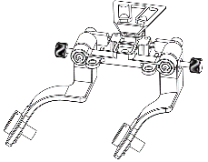
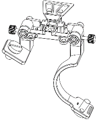
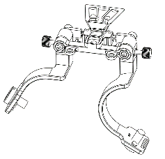
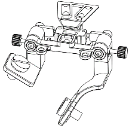

先进数字微光眼镜（以下简称“眼镜”）可通过ADNV-FM2支架连接头盔使用。支架共有4种组合方式，每种方式对应不同的视场角，分别是两横、两竖、左横右竖、左竖右横。

1) 两横组合：提供宽广的水平视场，适用于需要广阔视野的场景。

2) 两竖组合：提供垂直方向上宽广视场。

3) 左横右竖：结合了水平与垂直视场的优势，为观察者提供一个综合的视角。

4) 左竖右横：与左横右竖排列顺序相反，同样结合了水平与垂直视场的特点。

## **安装步骤**
   
   1) 准备好支架主体、支架、眼镜、M4\*8内六角沉头螺钉、对边2.5mm内六角扳手、装有WILCOX-L4G24或其他型号的翻斗车头盔；
   
   2) 通过M4\*8内六角沉头螺钉将支架主体与支架紧密拧合，确保不会松动；
   
   3) 通过1/4手拧螺钉，将眼镜的1/4-20英制螺纹孔与支架固定，确保眼镜不会松动；
   
   4) 将燕尾槽插入头盔翻斗车的插槽中（注：燕尾槽的安装提供了两种不同的档位选择，可利用对边3mm内六角扳手装卸燕尾槽下的M4\*8螺钉，实现档位的快速调节，获得更好的佩戴体验）；
   
   5) 为进一步加强支架与头盔的连接，可将头盔的弹力绳钩子与支架的挂钩处进行连接；
   
   6) 旋转支架调整到合适的瞳距后，拧紧M3\*20手拧螺钉

!!! Tip "特别注意:star:"
    - 如果旋转操作遇到阻碍，这可能是因为M4\*25螺钉固定得过于紧固。建议您使用对边3mm内六角扳手来适度放松螺钉，之后再尝试旋转，以确保操作的顺畅进行
----
