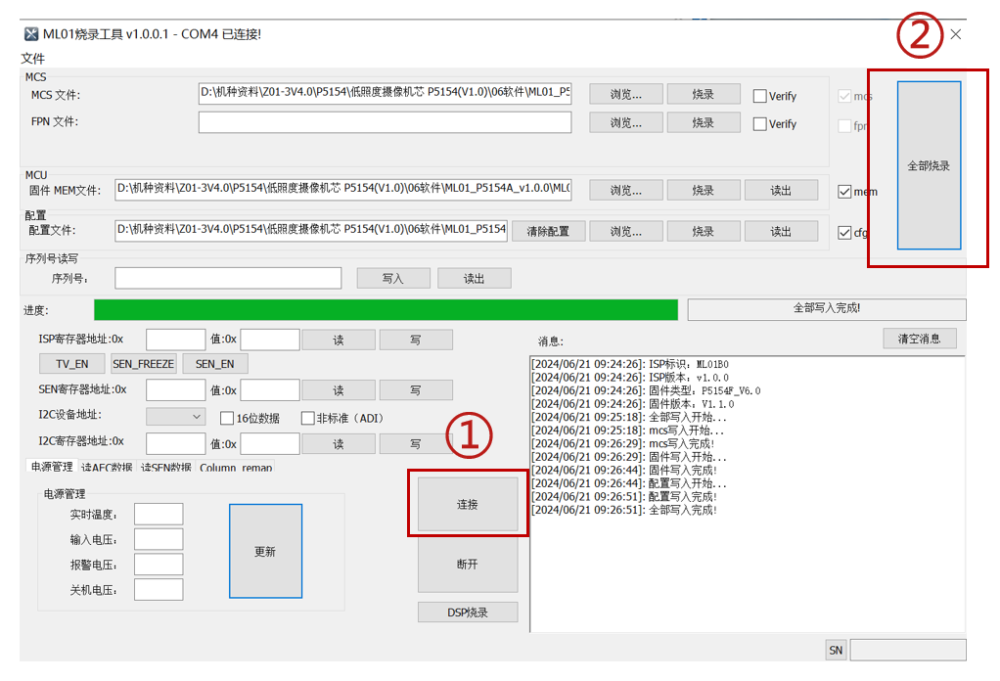

### 升级前准备
      
- 在给眼镜升级前，需准备好以下物品：

         
   |序号|名称|数量|
   |:--:|:-:|:-:|
   |1|电脑|1|
   |2|眼镜|1|
   |3|升级工装线|1|
   |4|上位机|1|

- 在软件升级过程中，确保眼镜保持开机状态，并保证其电量充足。 

###  连接设备

   - 连接眼镜
         
         将升级工装线的航插头插入眼镜的航插接口。
   
   - 连接电脑
   
         在确认航插头已经稳固连接眼镜后，将升级工装线的USB头插入电脑的USB接口。

###  打开升级包
      
      1. 双击打开压缩包，里面共有4个文件；
      
      2. 双击打开上位机。

###   升级步骤
      
      1. 点击“连接”，MCS栏、MCU栏、配置栏、消息栏自动加载出相关信息；

      2. 点击“全部烧录”，显示绿色进度条。当显示“全部写入成功”时，表示升级成功。
   
   

###   重启设备
   
      升级完成后，重启眼镜。