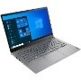
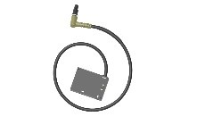
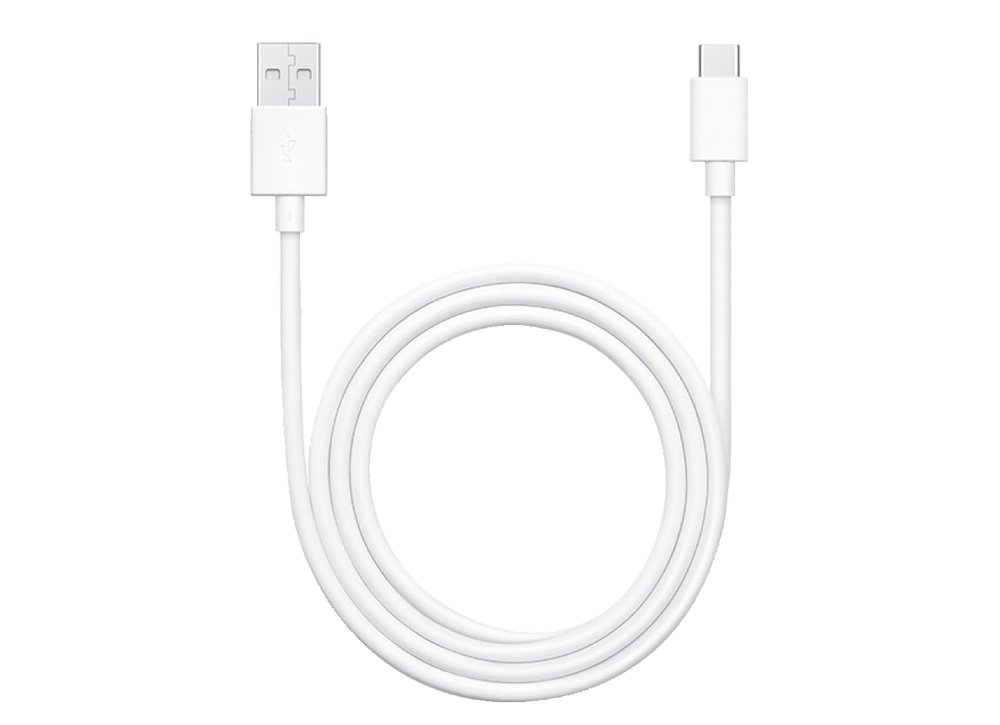
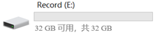
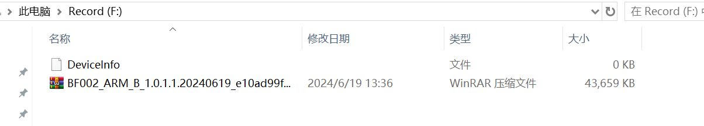
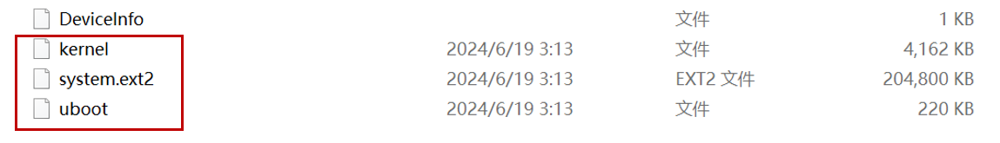

### 升级前准备
1.在给录制盒升级前，需准备好以下物品：

   
|序号|名称|示意图|数量|
|:--:|:-:|:-:|:-:|
|1|电脑||1|
|2|录制盒||1|
|3|Type-C数据线||1|
|4|升级软件压缩包||1|

2.确保录制盒电量充足，并将其关机。

### 连接设备
将Type-C数据线的Type-C头插入录制盒的Type-C接口，USB头插入电脑的USB接口。

### 导入升级软件压缩包
1. 双击打开U盘图标；
2. 将升级软件压缩包拷贝进U盘中
3. 将Type-C头从录制盒中拔出。

### 开启设备
将录制盒开机，静待约30s后，打开U盘，新增三个文件如图2所示，表示录制盒升级成功。
